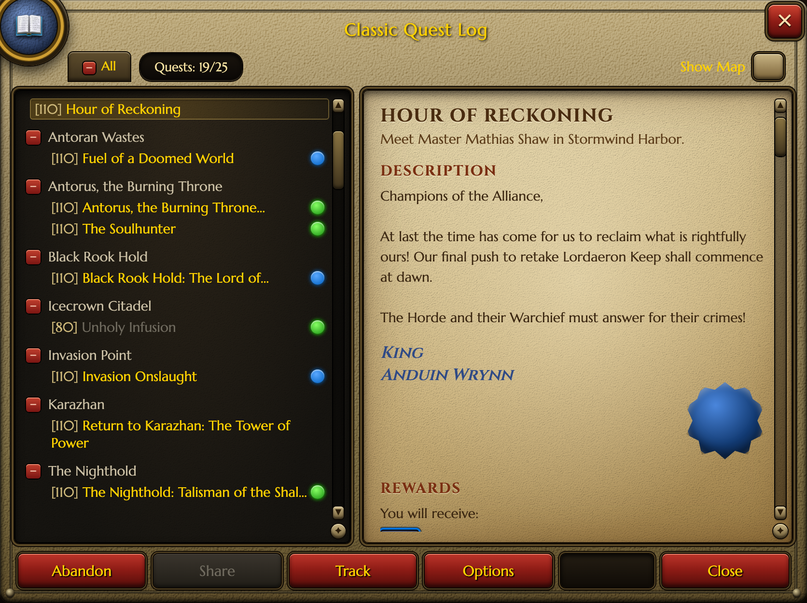

# UI Research

A collection of research and reference material for reconstructing distinctive
software / game UI aesthetics on the web.

## Studies

### [`wowUI/`](./wowUI) — World of Warcraft (Classic) panel UI
Research on WoW Classic's **text / menu UI** — quest log, character sheet, options,
tooltips — rather than the gameplay HUD.

- **[`wowUI/RESEARCH.md`](./wowUI/RESEARCH.md)** — full design breakdown: the visual
  language, typography, color system, nine-slice frame construction, per-panel layouts,
  the reusable widget kit, and where to get exact texture assets.
- **[`wowUI/index.html`](./wowUI/index.html)** — a self-contained, viewable example
  page reproducing the **Classic Quest Log** entirely in original CSS (no Blizzard
  texture files). Open it in any browser.



Construction highlights: a corner-straddling portrait medallion cast into the frame,
each region built as its own recessed metal sub-frame, framed widgets (counter, tab,
scrollbars, buttons), red gold-text action buttons, and procedural embossed
metal/parchment via an SVG `feDiffuseLighting` grain.

#### View the example
Open `wowUI/index.html` directly in a browser, or serve locally:

```sh
cd wowUI && python3 -m http.server 8000
# then visit http://localhost:8000
```
